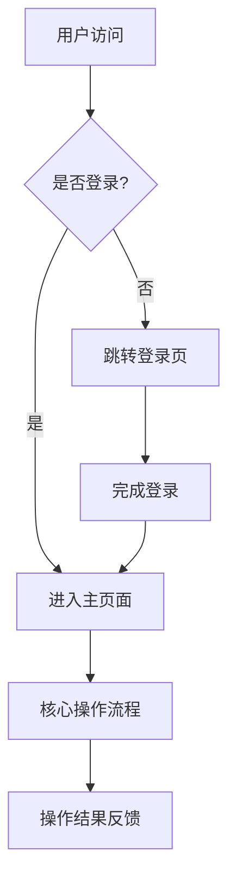
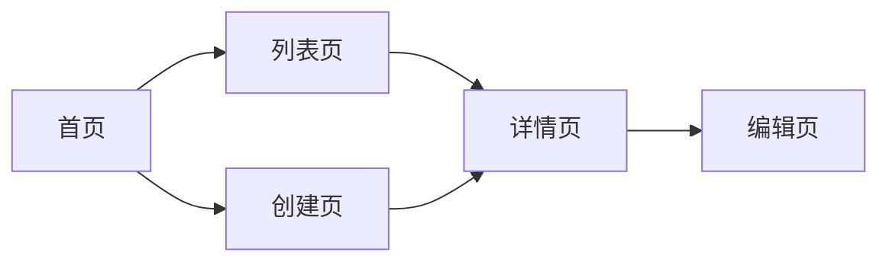
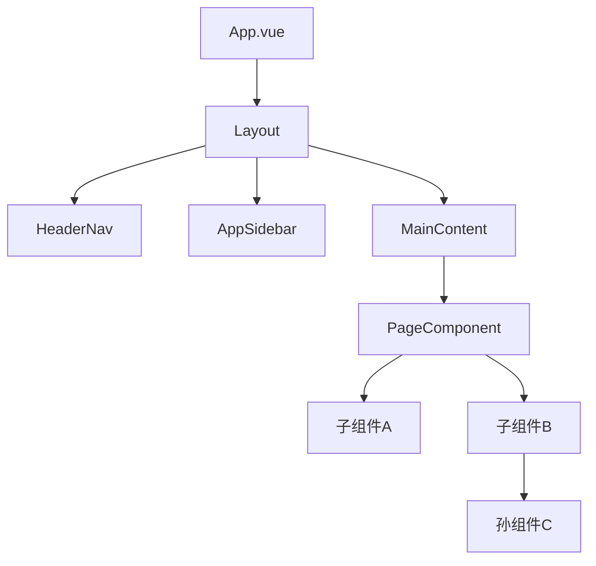
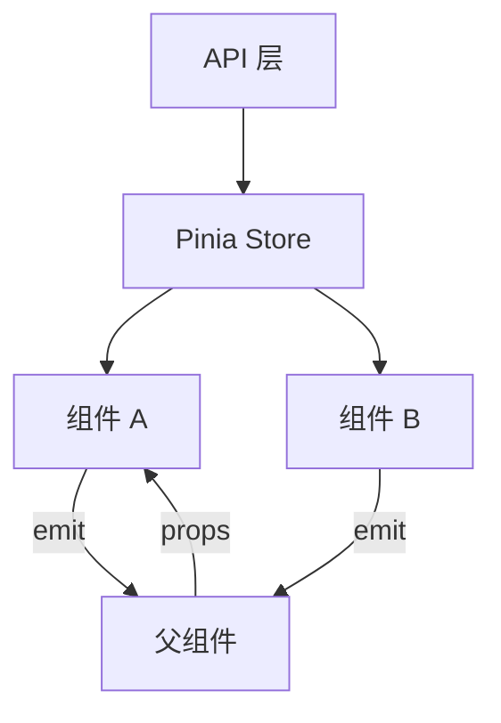
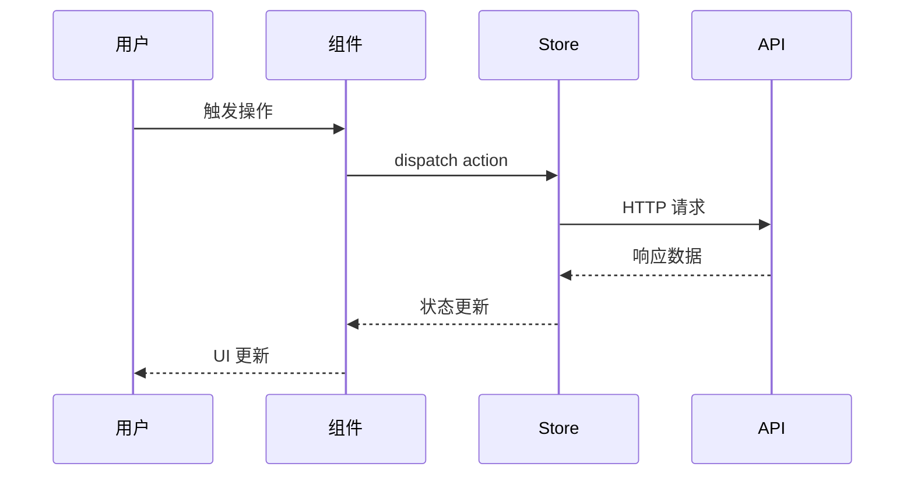
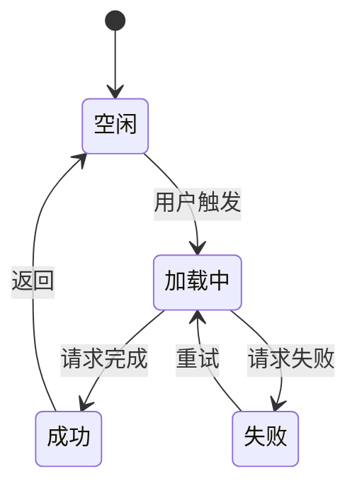
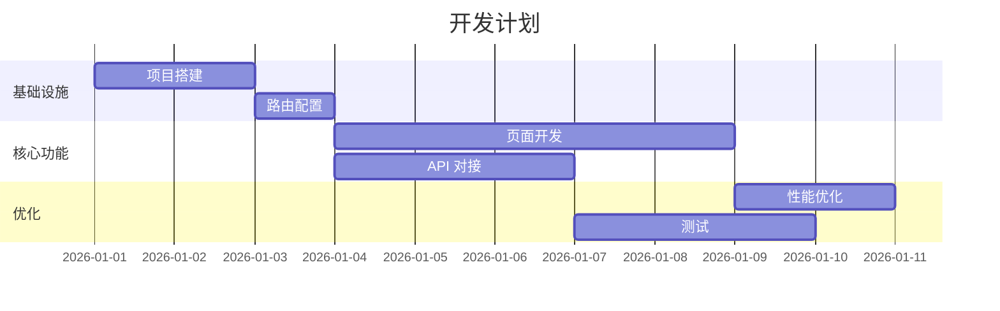

# 前端开发设计方案

## 1. 需求概述
- 需求背景与目标
- 核心用户场景
- 关键业务流程

### 业务流程图



## 2. 页面结构设计
### 2.1 页面清单与路由规划
| 页面名称 | 路由路径 | 页面类型 | 说明 |
|----------|---------|---------|------|

### 2.2 页面导航流程



### 2.3 布局方案
- Layout 选择与说明
- 公共区域设计（Header / Sidebar / Footer）

## 3. 组件架构设计

### 3.1 组件层级关系



### 3.2 组件详细设计
#### [组件名称]
- **职责**: 组件功能描述
- **Props**:
  ```typescript
  interface Props {
    // 属性定义
  }
  ```
- **Emits**:
  ```typescript
  interface Emits {
    // 事件定义
  }
  ```
- **内部状态**: 关键 ref / reactive
- **交互逻辑**: 用户操作 → 系统响应

### 3.3 可复用组件识别
| 组件名称 | 复用场景 | 来源 |
|----------|---------|------|

## 4. 数据流与状态管理

### 4.1 数据流向图



### 4.2 Store 结构定义
```typescript
interface StoreState {
  // 状态字段
}
```

### 4.3 缓存策略
- 缓存范围
- 失效机制

## 5. API 对接设计

### 5.1 接口清单
| 接口名称 | Method | Path | 请求参数 | 响应结构 | 说明 |
|----------|--------|------|---------|---------|------|

### 5.2 请求/响应流程



### 5.3 错误处理策略
| 错误类型 | 处理方式 | 用户提示 |
|----------|---------|---------|

## 6. TypeScript 类型定义
### 6.1 核心实体类型
```typescript
// 业务实体类型定义
```

### 6.2 API 请求/响应类型
```typescript
// API 类型定义
```

## 7. 交互与动效设计

### 7.1 用户操作流程



### 7.2 微交互设计
| 交互场景 | 动效描述 | 实现方式 |
|----------|---------|---------|

## 8. 响应式与性能优化
### 8.1 断点策略
| 断点 | 宽度范围 | 布局变化 |
|------|---------|---------|

### 8.2 性能优化
- 虚拟滚动
- 懒加载
- 代码分割

## 9. 技术风险与难点
| 风险项 | 影响等级 | 解决方案 | 备选方案 |
|--------|---------|---------|---------|

## 10. 开发任务拆解

### 10.1 任务依赖关系



### 10.2 任务清单
| 任务 | 优先级 | 预估工时 | 依赖 | 负责人 |
|------|--------|---------|------|--------|
